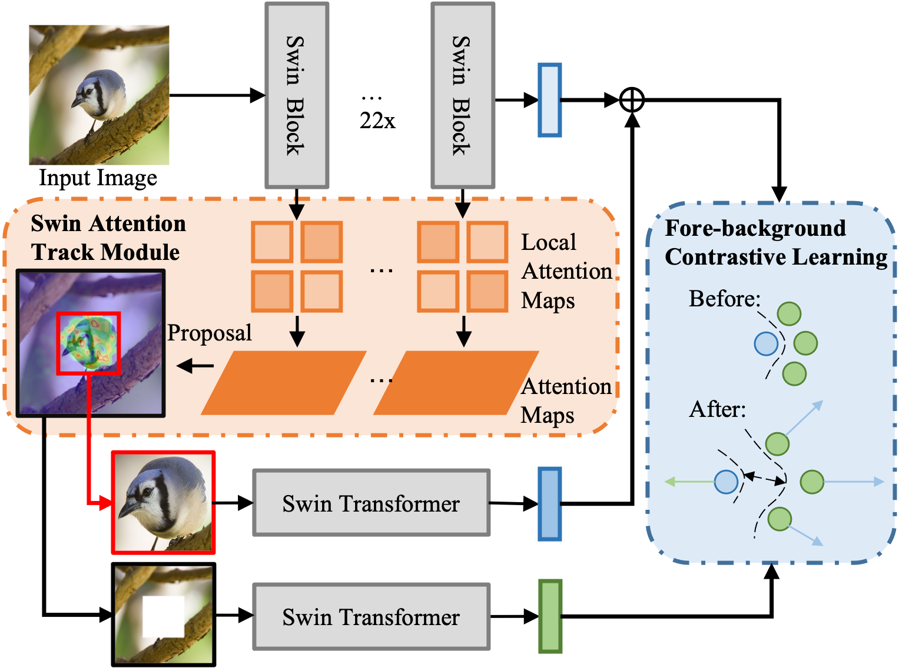

# SwinFG: A Fine-grained Recognition Scheme Based on Swin Transformer


## Framework of SwinFG


## Dependencies:
+ Python 3.8.12
+ PyTorch 1.5.1
+ torchvision 0.6.1

## Usage
### 1. Pre-trained model

You can download the official pre-trained model file of the swin Transformer from [here](https://github.com/microsoft/Swin-Transformer). 

### 2. Prepare data
The dataset we used can be downloaded here: 

+ [CUB-200-2011](http://www.vision.caltech.edu/visipedia/CUB-200-2011.html)
+ [Stanford Cars](https://ai.stanford.edu/~jkrause/cars/car_dataset.html)
+ [Stanford Dogs](http://vision.stanford.edu/aditya86/ImageNetDogs/)
+ [NABirds](http://dl.allaboutbirds.org/nabirds)
+ [iNaturalist 2017](https://github.com/visipedia/inat_comp/tree/master/2017)

### 3. Install required packages

```bash
pip3 install -r requirements.txt
```

### 4. Train

```bash
CUDA_VISIBLE_DEVICES=0  python3 -m torch.distributed.launch --nproc_per_node 1 train.py --dataset CUB --name myTrain 
```

### 4. Citing SwinFG

```
@article{MA2024123021,
title = {SwinFG: A fine-grained recognition scheme based on swin transformer},
journal = {Expert Systems with Applications},
volume = {244},
pages = {123021},
year = {2024},
issn = {0957-4174},
doi = {https://doi.org/10.1016/j.eswa.2023.123021},
author = {Zhipeng Ma and Xiaoyu Wu and Anzhuo Chu and Lei Huang and Zhiqiang Wei}
}
```
